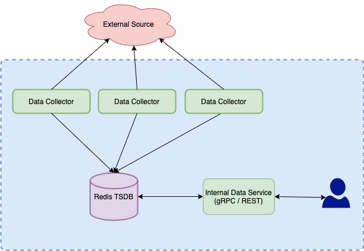

# Market Data [gRPC] Service 

This a redis based market data service, which can be used to service internal market data clients with _real time_ data. 

This uses Redis (with `redistimeseries` module). TimeSeries is just time ordered store of the datasets. 
Here in redis, the `key` is `timestamp` and `value` is `numeric`. We can not store non-numeric values in the `value` field.

### Idea of this process -
The process works as a data collector and also provider of real time market data. 

We will have a set (one or more) data collectors, which will gather market data from different external sources. 
Transform and store them in our internal REDIS db. 

With this internal store (more on the storage model below), we will be able to provide spot / time_series data to 
anyone of the users (agnostic to external source) 



### Data model behind it -
Redis TSDB stores the data in time_series `key`. Which is representation of key in hash-map/dict. We can even store 
meta-data, which can be used to query.

Example:
```bash
1) 1) "ts_market_data:TEST:AAPL:price"
   2) 1) 1) "type"
         2) "Stock"
      2) 1) "exchange"
         2) "NASDAQ"
   3) 1) 1) (integer) 1612128356648
         2) "310.063066200331"
      2) 1) (integer) 1612128026653
         2) "965.199926739139"
2) 1) "ts_market_data:TEST:AAPL:volume"
   2) 1) 1) "type"
         2) "Stock"
      2) 1) "exchange"
         2) "NASDAQ"
   3) 1) 1) (integer) 1612128356648
         2) "365"
      2) 1) (integer) 1612128026653
         2) "537"
3) 1) "ts_market_data:UNKNOWN:AAPL:price"
   2) 1) 1) "type"
         2) "Stock"
      2) 1) "exchange"
         2) "NASDAQ"
   3) 1) 1) (integer) 1612128850618
         2) "864.102732102485"
4) 1) "ts_market_data:UNKNOWN:AAPL:volume"
   2) 1) 1) "type"
         2) "Stock"
      2) 1) "exchange"
         2) "NASDAQ"
   3) 1) 1) (integer) 1612128850618
         2) "830"
```

Our use case :
1. We need current / latest price of any security. (agnostic to external source)
2. Able to provide time series order of the data. (agnostic to the external source)
3. Future, we might want to pick and choose the source for particular type of price (ex: EOD will be xpressfeed)

With this in mind, I am thinking of using following mode -
1. The key will be composite key with i.e. `ts_market_data:source:symbol:type`
2. `type` is to support different type of data - price, volume etc.
3. We can also store meta-data about the symbol (`exchange, type, currency`). 
   Restriction here is we can not add new labels after the key is created (not  big restriction), 
   when we want to add new labels - we recreate the key 

### Bring up the local (dev) env
Simple spring boot application.

### To Do
1. Redis `TS.add` will error if the timestamp already exists, consider check and set or waterfall logic for update.
2. Env specific deployment using K8s and other stuff.

### Other consideration
#### Load Balancing and distribution 
1. Multiple instances of this process can be spun, to support the load (with ELB/nginx to balance the requests) 
2. Separate out gRPC and Data collector to separate process (potentially, even separate out collectors based on 
   different external sources at each instance).

### Commands
```bash
grpcurl --plaintext localhost:9091 list com.carta.marketdata.service.MarketDataService

grpcurl --plaintext localhost:9091 com.carta.marketdata.service.MarketDataService.heartbeat

grpcurl --plaintext -d '{"symbol" : "AAPL"}' localhost:9091 com.carta.marketdata.service.MarketDataService.spot

grpcurl --plaintext -d '{"row_count": 5, "symbol" : "AAPL"}' localhost:9091 com.carta.marketdata.service.MarketDataService.timeseries

# -- Starting redis with time series:

docker run -p 6379:6379 -it --rm redislabs/redistimeseries
```
